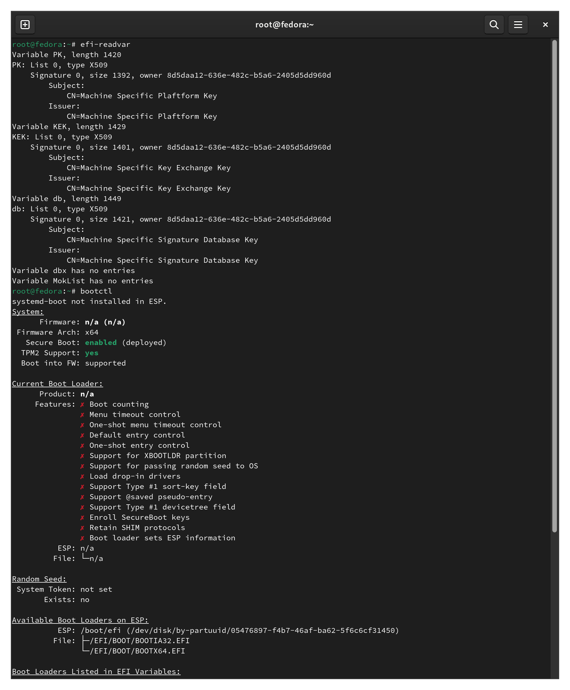

An ansible role to setup custom secure boot keys on Fedora. Automates the steps from [sysguides.com tutorial for custom keys on Fedora](https://sysguides.com/fedora-uefi-secure-boot-with-custom-keys).

To apply the configuration locally:
  * Boot in "audit mode"
  * Make sure all keys were deleted ("reset" often returns to defaults) and Microsoft CA keys are not active.

```
root@fedora:~# efi-readvar 
Variable PK has no entries
Variable KEK has no entries
Variable db has no entries
Variable dbx has no entries
Variable MokList has no entries

root@fedora:~# echo "To apply the configuration locally"
root@fedora:/root/custom_secure_boot# ansible-playbook site.yml
...
PLAY RECAP *********************************************************************
localhost                  : ok=42   changed=25   unreachable=0    failed=0    skipped=0    rescued=0    ignored=0
root@fedora:~# efi-readvar 
Variable PK, length 1420
PK: List 0, type X509
    Signature 0, size 1392, owner 8790c430-3b8e-4d21-a5b3-91780886df3b
        Subject:
            CN=Machine Specific Plaftform Key
        Issuer:
            CN=Machine Specific Plaftform Key
...
```

